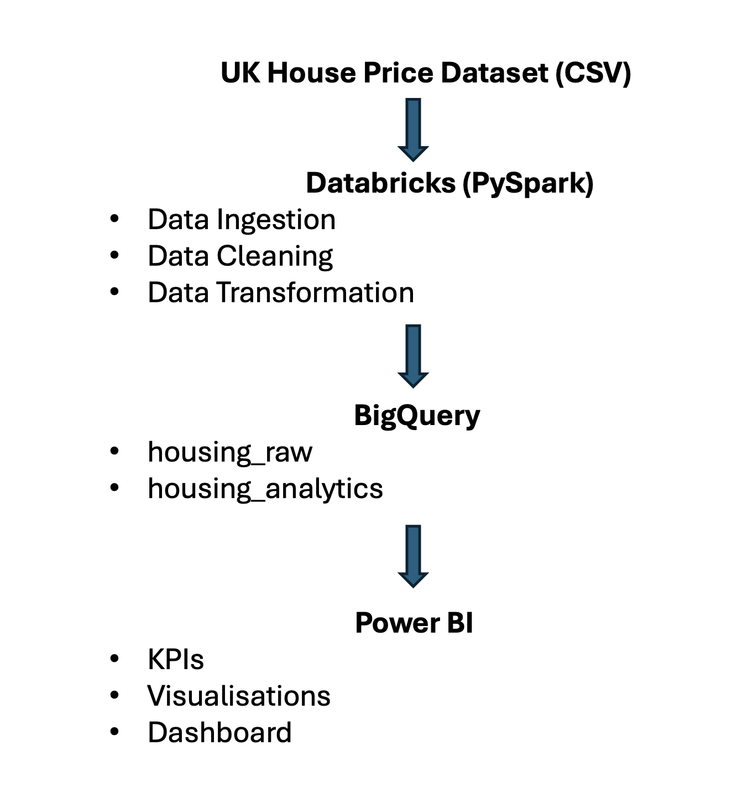

# UK Housing Data Pipeline Project #

## Project Overview ##

This project demonstrates an end-to-end data engineering and analytics pipeline using UK housing transaction data from 2015 to 2024. The goal was to ingest raw housing data, perform data cleaning and transformation using PySpark in Databricks, store processed data in Google BigQuery, and prepare the data for reporting and visualisation in Power BI.

The dataset contains approximately 90,000 UK housing transactions and includes information such as property prices, transaction dates, property types, postcodes, districts, towns, and ownership details.

## Technologies Used ##

* Python
* PySpark
* Databricks
* SQL
* Google BigQuery
* Google Cloud Storage
* Power BI
* Data Pipeline Architecture

## Architecture Diagram ##

## Data Ingestion ##

The raw housing dataset was uploaded and loaded into Databricks using PySpark. Initial validation steps included:

* Schema inspection
* Data preview and validation
* Row count verification

## Data Cleaning ##

Data quality checks were performed to improve the reliability of the dataset.

Cleaning activities included:

* Duplicate detection
* Duplicate removal
* Missing value analysis

The dataset was reduced from 90,000 records to 89,957 records after duplicate removal.

## Data Transformation ##

Several transformations were applied using PySpark:

* Created a sale_year column from transaction dates
* Created a sale_month column from transaction dates
* Calculated average house prices by district
* Calculated average house prices by property type
* Analysed new build versus existing properties
* Analysed freehold versus leasehold properties
* Analysed yearly transaction volumes

The transformed dataset was stored for further analysis.

## BigQuery Analytics ##

The processed data was loaded into Google BigQuery for analytical querying.

SQL queries were used to analyse:

* Average house price by year
* Number of housing transactions by year
* Average house price by property type
* Top districts by average house price
* New build versus existing property prices
* Freehold versus leasehold property prices

## Data Export ##

The processed dataset was exported from BigQuery and stored as a processed CSV file for future use.

## Dashboard Reporting ##

The final stage of the project involves connecting the processed dataset to Power BI to create an interactive dashboard containing:

* Key performance indicators (KPIs)
* Housing price trends
* Property type analysis
* District-level insights
* Transaction volume analysis

## Key Outcomes ##

* Built an end-to-end cloud data pipeline
* Processed and analysed UK housing transaction data
* Applied data cleaning and transformation using PySpark
* Performed cloud-based analytics using BigQuery
* Prepared data for business intelligence reporting in Power BI
* Demonstrated modern data engineering workflow using cloud technologies
